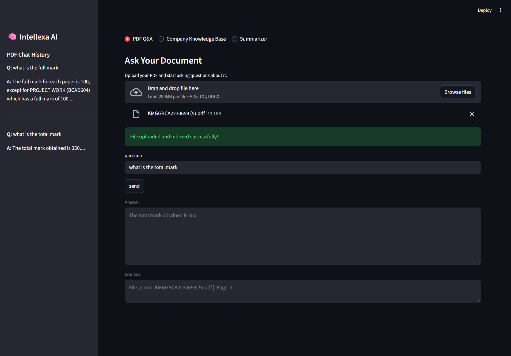
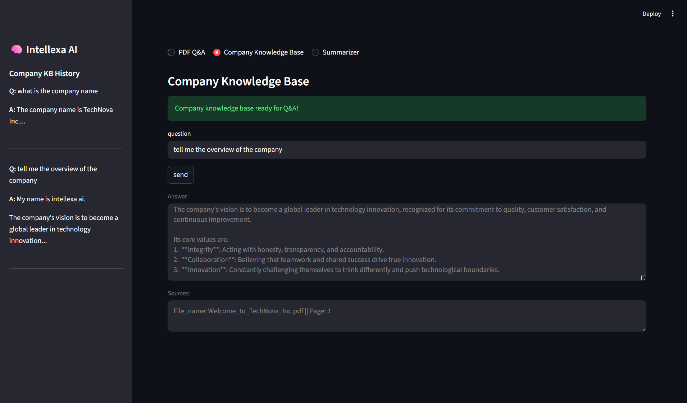

# 🧠 Intellexa AI - Enterprise Knowledge Platform

## 🚀 Phase 3 Complete - Advanced Features & Chat History!

### What's New:
- **3-Tab Professional Interface** - PDF Q&A, Company KB, and Document Summarizer
- **Smart Chat History** - Separate conversation memory for each tab
- **Document Summarization** - Instant bullet-point summaries for any document
- **Enhanced User Experience** - Auto-cleanup, better error handling

### One-Liner
"Intellexa AI transforms documents into conversational knowledge bases using advanced RAG technology."

### Overview
Intellexa AI is an enterprise-grade knowledge platform that enables intelligent Q&A, summarization, and document analysis. Built with modern AI technologies, it provides instant, accurate answers with full source transparency.

### Business Problem
Enterprises struggle with information scattered across multiple documents - HR policies, research papers, company handbooks. Manual searching is time-consuming and inefficient. Intellexa AI solves this by providing instant access to organizational knowledge.

### Tech Stack
* Python with LangChain framework
* Google Vertex AI - Gemini 2.5 Flash Lite & text-embedding-005
* ChromaDB & FAISS - Hybrid vector database strategy
* Streamlit - Professional web interface
* Multi-format Support - PDF, DOCX, TXT document processing


### Architecture
```text
intellexa-ai/
├── app.py
├── requirements.txt
├── README.md
├── src/
│   ├── config.py
│   ├── chains/
│   ├── vector_store/
│   └── core/
└── data/
    ├── company_kb/
    └── user_documents/
```

### **Hybrid Database Strategy:**
- **Company KB**: ChromaDB with persistence - rarely changes, always available
- **User Uploads**: FAISS in-memory - auto-clears on restart, no stale data
- **Data Privacy**: User documents never persist, company data always secure

### Key Features

#### Three Powerful Interfaces:
- **PDF Q&A Tab**: Upload and query personal documents with FAISS in-memory storage
- **Company KB Tab**: Access pre-loaded enterprise knowledge with ChromaDB persistence
- **Summarizer Tab**: Get instant document summaries and text analysis

#### Advanced RAG Pipeline:
1. **Smart Document Processing** - Multi-format support with metadata preservation
2. **Intelligent Chunking** - Context-aware text splitting
3. **Vector Embeddings** - Google Vertex AI integration
4. **Semantic Search** - Hybrid FAISS/ChromaDB retrieval
5. **AI-Powered Answers** - Gemini LLM with source citations
6. **Chat Memory** - Separate conversation history for each feature

### Main Interface - Three Tab System

#### PDF Q&A Tab

*Upload and query personal documents with FAISS in-memory storage*

#### Company KB Tab

*Access enterprise knowledge base with ChromaDB persistence*

#### Summarizer Tab

*Get instant document summaries and analyze text content*

### Quick Start

*First-Time Setup:*
```bash
# 1. Clone repository
git clone https://github.com/suubha7/intellexa-ai.git
cd intellexa-ai

# 2. Install dependencies
pip install -r requirements.txt

# 3. Set up Google Cloud credentials
export GOOGLE_APPLICATION_CREDENTIALS="path/to/your/credentials.json"

# 4. Create data folders
mkdir -p data/company_kb data/user_documents

# 5. Add company documents (optional)
# Place your PDF/DOCX files in data/company_kb/ folder

# 6. Launch application
streamlit run app.py
```

### Deploy on Hugging Face Spaces

To deploy this app on Hugging Face:

1. Create a new Space → Select **Streamlit** SDK
2. Upload your project files (`app.py`, `requirements.txt`, `README.md`, `src/`)
3. Add your Google Cloud credentials in **Settings → Secrets**
4. Set environment variable in `chain.py`:
```python
os.environ["GOOGLE_APPLICATION_CREDENTIALS"] = "gcloud_service_account.json"


### Access Interfaces:
* PDF Q&A Tab: Upload documents with FAISS in-memory processing
* Company KB Tab: Query enterprise knowledge with ChromaDB persistence
* Summarizer Tab: Upload files or paste text for instant summaries

### Results & Impact

* 90% faster information retrieval vs manual searching
* Accurate answers with verifiable sources
* Smart data management - FAISS for users, ChromaDB for company
* Enterprise-ready scalable architecture
* User-friendly web interface for non-technical users
* Auto-cleanup - No stale user data accumulation

### Roadmap
* Phase 1: Core RAG MVP (Command-line)
* Phase 2: Web Interface & Multi-Document
* Phase 3: Advanced Features & Chat History
* Phase 4: Enterprise Deployment 

###  Author

**Subham Maharana**

Gen AI Developer building practical enterprise solutions. Passionate about making AI accessible and useful for real-world business challenges.
